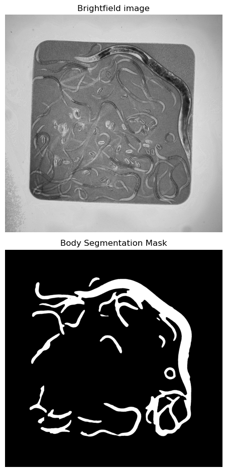
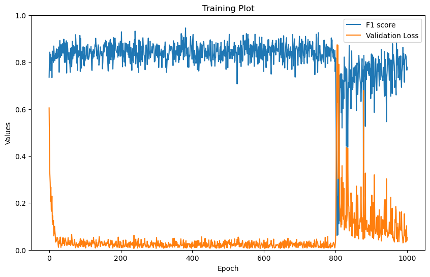
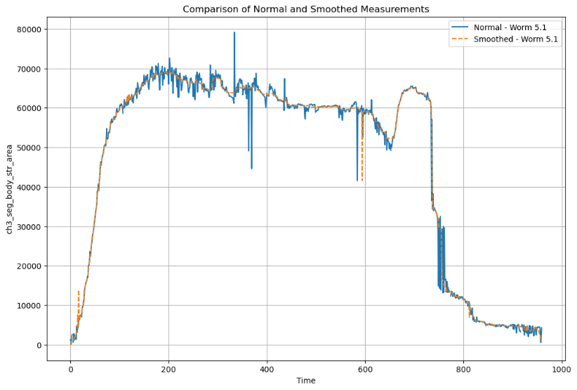
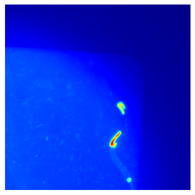
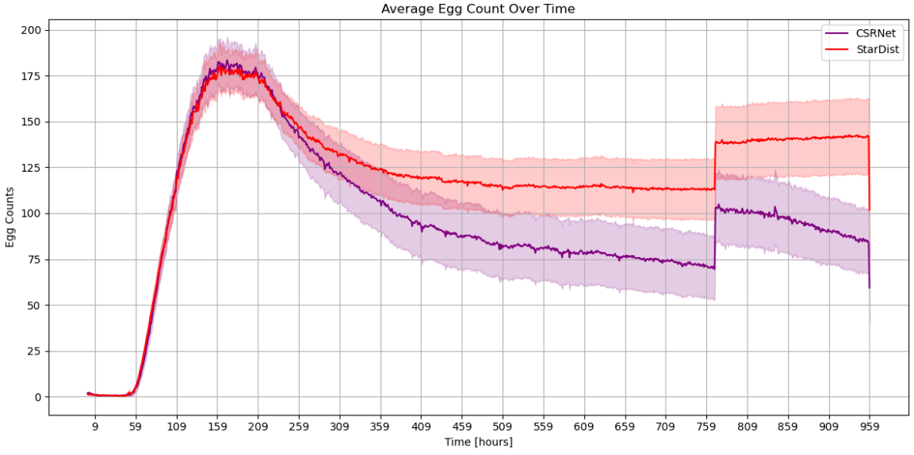
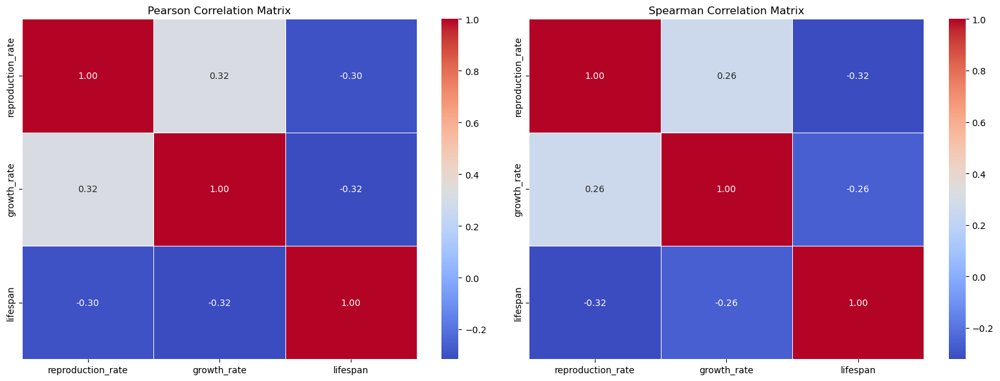

# towbinlab

**Image Analysis and Deep Learning Tools for *C. elegans* Lifespan Research**

Developed as part of an MSc thesis in Bioinformatics & Computational Biology at the University of Bern (Towbin Lab, 2024). This repository contains a full pipeline for automated segmentation and quantification of *C. elegans* body size and reproductive effort from high-throughput brightfield microscopy images — enabling large-scale, marker-free aging studies.

> **Thesis:** *On the segmentation and lifespan of C. elegans* — Santiago Marín Martínez, 2024. Supervised by Prof. Dr. B. Towbin, University of Bern.

---

## Overview

Traditional measurements of *C. elegans* growth, reproduction, and lifespan are labour-intensive and difficult to scale. This pipeline automates the full workflow: from raw SQUID imaging system output through model inference to statistical analysis of growth rates, egg counts, and lifespan correlations.

### Key features

- **Marker-free body segmentation** using U-Net++ (EfficientNet-B4 encoder) trained on brightfield images — no fluorescent body channel required
- **Egg counting in crowded scenes** using CSRNet density maps, outperforming StarDist at high egg densities
- **End-to-end pipeline**: BMP → TIFF conversion → preprocessing → model inference → growth/reproduction/lifespan analysis
- **Scale**: ~40 TB of brightfield microscopy images processed across multi-week lifespan experiments
- **Deployment**: trained models run on HPC cluster via SLURM with batch processing and CI/CD integration
- **Robustness**: handles focus drift, E. coli background noise, and overlapping worms

---

## Pipeline Architecture

```
SQUID Imaging System (BMP output)
        │
        ▼
  [conversion] ──────────────────────────────────────────────
  BMP → 3-channel TIFF (brightfield + 2x fluorescent)
        │
        ▼
  [channel_separator]
  Extract single-channel TIFFs for annotation (micro_sam)
        │
        ├──────────────────────────┐
        ▼                          ▼
  [models/body_seg]          [models/egg_count]
  U-Net++ body segmentation  CSRNet egg density maps
  F1 = 0.846 (val)           F1 = 0.607 (val)
        │                          │
        ▼                          ▼
  Body masks → growth        Density maps → egg centroids
  metrics (area, length,     → egg counts over time
  volume) via towbintools
        │                          │
        └──────────┬───────────────┘
                   ▼
          [data_analysis]
          Merge filemaps, compute growth rates,
          reproduction rates, lifespan correlations
          (mex3.ipynb / lifespan.ipynb)
                   │
                   ▼
            [plotting]
            Visualisation of all metrics
```

---

## Results

### Body Segmentation — U-Net++

U-Net++ with an EfficientNet-B4 encoder was trained on 1,573 brightfield TIFF images (2000×2000px) annotated using `micro_sam` zero-shot segmentation. Training used Focal Tversky Loss on 512×512 tiles, Adam optimiser (lr=1e-4), over 1,000 epochs on 2× Nvidia Quadro RTX 6000 GPUs.

**Best model: F1 = 0.846 (epoch 602)**

| Metric | Value |
|---|---|
| Validation F1 | 0.846 |
| Training images | 1,573 |
| Input resolution | 512×512 tiles |
| Encoder | EfficientNet-B4 (ImageNet pretrained) |
| Loss function | Focal Tversky Loss |

<p align="center">
  
  <br><em>Brightfield input image (top) and U-Net++ segmentation mask (bottom)</em>
</p>

<p align="center">
  
  <br><em>U-Net++ training curve — F1 score (blue) and validation loss (orange) over 1,000 epochs. Learning breakdown visible after epoch 800, suggesting early stopping as a future improvement.</em>
</p>

Growth measurements (body area, length, volume) are extracted from the predicted masks using the `towbintools` pipeline. Outliers from worm self-overlap are handled via median filtering (kernel size 25).

<p align="center">
  
  <br><em>Individual worm growth curve: raw (blue) vs median-smoothed (orange) body area over time. Smoothing corrects for outliers caused by worm self-overlap in the segmentation masks.</em>
</p>

---

### Egg Counting — CSRNet

CSRNet (Congested Scene Recognition Network) generates pixel-level density maps for egg counting, allowing robust quantification even when eggs are clustered or overlapping — a key limitation of instance segmentation approaches like StarDist. Training used 136 manually annotated brightfield images with Gaussian-filtered ground truth density maps (σ=8).

**Best model: F1 = 0.607 (epoch 509)**

| Metric | Value |
|---|---|
| Validation F1 | 0.607 |
| Training images | 136 (point-annotated) |
| Input resolution | 1028×1028 tiles |
| Frontend | VGG16 (ImageNet pretrained) |
| Loss function | Mean Squared Error |

<p align="center">
  
  <br><em>CSRNet density map output — heatmap indicating predicted egg locations and density</em>
</p>

<p align="center">
  
  <br><em>Average egg counts over time: CSRNet (purple) vs StarDist (red). CSRNet achieves higher peak counts in crowded scenes; StarDist retains counts longer due to less sensitivity to egg degradation.</em>
</p>

---

### Biological Results

Applied to multi-week lifespan experiments (n=60) and mex-3 RNAi inhibition comparison (n=157):

- **mex-3 inhibition** significantly increases reproductive rate (p=6×10⁻¹⁴, T=8.26) with no significant effect on growth rate — suggesting decoupling of growth and reproduction
- **Growth rate and reproduction rate are both inversely correlated with lifespan**, consistent with existing aging literature
- Multiple linear regression (R²=0.128) using smoothed area (growth) and CSRNet (reproduction) metrics best predicts lifespan

<p align="center">
  
  <br><em>Pearson (left) and Spearman (right) correlation matrices for growth rate, reproduction rate and lifespan across lifespan experiment worms (n=60)</em>
</p>

---

## Repository Structure

```
towbinlab/
│
├── conversion/          # Convert SQUID BMP output → 3-channel TIFF
├── channel_separator/   # Extract single-channel TIFFs for micro_sam annotation
│
├── models/
│   ├── body_seg/        # U-Net++ weights + inference scripts (model file via Git LFS / instructions in dir)
│   └── egg_count/       # CSRNet weights + inference scripts
│
├── csrnet/              # Egg counting pipeline (brightfield channel)
├── stardist/            # Alternative egg counting (germline fluorescent channel)
│
├── data_analysis/
│   ├── mex3.ipynb       # Growth & reproduction rate analysis for mex-3 RNAi experiment
│   └── lifespan.ipynb   # Lifespan correlation analysis
│
└── plotting/            # Visualisation utilities
                         #   - Training metrics
                         #   - Per-worm growth curves
                         #   - Per-worm egg counts over time
                         #   - GIF generation from channel images/masks
```

---

## Tech Stack

| Component | Tools |
|---|---|
| Deep learning | PyTorch, segmentation-models-pytorch |
| Body segmentation | U-Net++ / EfficientNet-B4 |
| Egg counting | CSRNet / VGG16 |
| Annotation | micro_sam (ViT-L), LabelMe |
| Data processing | towbintools, NumPy, SciPy |
| Analysis | pandas, scikit-learn, statsmodels |
| Visualisation | matplotlib, seaborn |
| Infrastructure | SLURM (HPC), GitHub CI/CD, Unix/Bash |
| Image format | BMP → TIFF (3000×2000px) |

---

## Models

The **U-Net++ body segmentation model** exceeds GitHub's file size limit and cannot be stored directly. Instructions for retrieval are provided in `models/body_seg/`.

The **CSRNet egg counting model** is stored in `models/egg_count/`.

---

## Data

Raw image data (~40 TB) is not publicly available. The pipeline is designed for images captured with the [SQUID imaging system](https://www.squid-imaging.org/) in the following format:

- **Format**: BMP → converted to 3-channel TIFF
- **Resolution**: 3000×2000px per channel
- **Channels**: brightfield, mCherry (body/RPL-34), sGFP2 (germline/GLH-1)
- **Acquisition**: automated, hourly, over multi-week lifespan experiments
- **Strain**: *C. elegans* wBT318 (dual-labelled rpl-34::mCherry; glh-1::sGFP2)

---

## Citation

If you use this code, please cite:

> Marín Martínez, S. (2024). *On the segmentation and lifespan of C. elegans*. MSc Thesis, University of Bern. Supervised by Prof. Dr. B. Towbin.

---

## Acknowledgements

Developed in the [Towbin Lab](https://www.towbinlab.org/), University of Bern. Thanks to the lab for providing imaging infrastructure, biological expertise, and the `towbintools` package.
